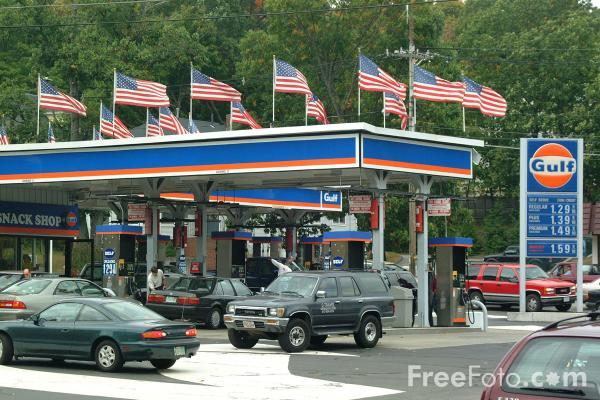
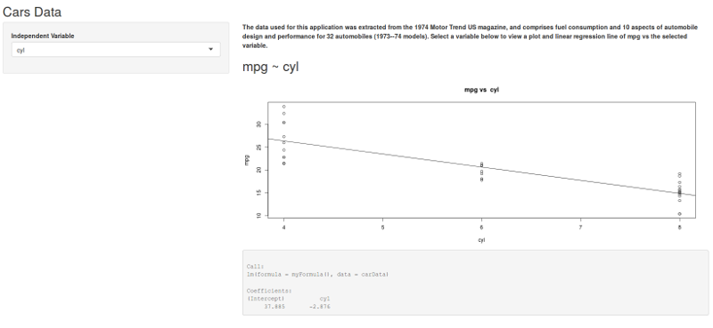

<style>
slide {
  background: -moz-linear-gradient(top,  rgba(0,0,0,0) 0%, rgba(172,191,193,0.9) 100%); /* FF3.6+ */
  background: -webkit-gradient(linear, left top, left bottom, color-stop(0%,rgba(0,0,0,0)), color-stop(100%,rgba(172,191,193,0.9))); /* Chrome,Safari4+ */
  background: -webkit-linear-gradient(top,  rgba(0,0,0,0) 0%,rgba(172,191,193,0.9) 100%); /* Chrome10+,Safari5.1+ */
  background: -o-linear-gradient(top,  rgba(0,0,0,0) 0%,rgba(172,191,193,0.9) 100%); /* Opera 11.10+ */
  background: -ms-linear-gradient(top,  rgba(0,0,0,0) 0%,rgba(172,191,193,0.9) 100%); /* IE10+ */
  background: linear-gradient(to bottom,  rgba(0,0,0,0) 0%,rgba(172,191,193,0.9) 100%); /* W3C */
  filter: progid:DXImageTransform.Microsoft.gradient( startColorstr='#00000000', endColorstr='#e6acbfc1',GradientType=0 ); /* IE6-9 */
}

img {
  border: 5px solid darkslategray;
}

strong{
  font-weight: bold;
  text-decoration: underline;
}
</style>

## Gone Are the Days of Cheap Gas



When was the last time you saw these prices? I'm willing to bet that gas mileage was a factor in which car you last
purchased. There is a tool that can help you see how much a particular feature (e.g. 4 vs. 6 cylinders) affects you gas
mileage.

--- #gas

## Dataset

The data used for this application was extracted from the 1974 Motor Trend US magazine, and comprises fuel consumption 
and 10 aspects of automobile design and performance for 32 automobiles (1973--74 models). Select a variable below to 
view a plot and linear regression line of mpg vs the selected variable." 

```{r}
data(mtcars)
head(mtcars)
```

--- #dataset

## Tool

The tool can be found at (https://johnmckinzie.shinyapps.io/Project/). It is important to know, that this tool only 
compares one variable at a time to mpg, so use the results with caution.



--- #tool

## Example

Let's saw you want to know how much getting an automatic instead of an manual will affect your mileage. If you select 
`am`, then you will see that a manual transmission will increase your gas mileage by 7.245 at a 95% confidence interval.
**Now that's money in your pocket!**


